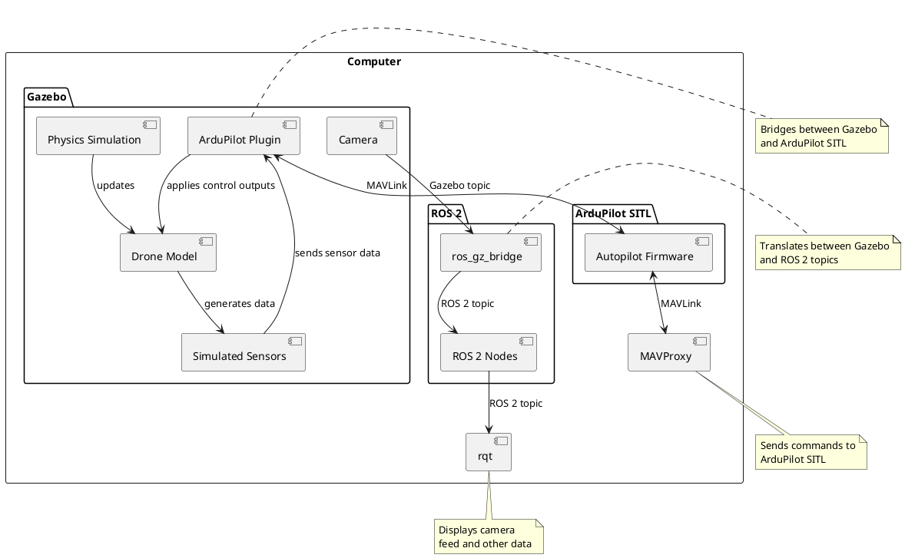

---
tags:
  - bp
---
```bash
pip install opencv-python
pip install numpy
pip install dronekit
pip install pymavlink
```

```bash
sudo apt-get update
sudo apt-get install libgstreamer1.0-0 gstreamer1.0-plugins-base gstreamer1.0-plugins-good gstreamer1.0-plugins-bad gstreamer1.0-plugins-ugly gstreamer1.0-libav gstreamer1.0-doc gstreamer1.0-tools gstreamer1.0-x gstreamer1.0-alsa gstreamer1.0-gl gstreamer1.0-gtk3 gstreamer1.0-qt5 gstreamer1.0-pulseaudio
```

> [!warning] It turns out that Gazebo uses some internal transport protocol (I believe similar to ROS), so conventional libraries to read the camera feed don't work. I decided to go via the path of least resistance and use ROS2 with Gazebo and Ardupilot.

# Setup process
[[Setup ArduPilot + Gazebo + ROS2]]

# Configuration Architecture

